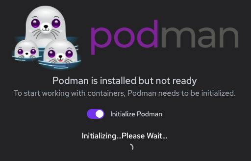

# Podman

I want to consider some alternatives to Docker and Podman seems to be an often
recommended one.

In this post I am going to take a quick look on how to install it and use it.

The Podman website is at [podman.io](https://podman.io).
The GitHub repository is at
[`containers/podman`](https://github.com/containers/podman).

There is also [Podman Desktop](https://podman-desktop.io) which is the Podman
analogue of Docker Desktop.

The documentation for Podman is on
[ReadTheDocs](https://podman.readthedocs.io/en/latest/index.html).

One important bit about Podman is that it is compatible with Docker clients, so
any Docker-related tutorial should be directly transferable to Podman, however I
have not tried this myself.

I am using macOS and Podman can be installed using Homebrew, which is how I
prefer to install new software on macOS.
This is the command to use to install Podman using Homebrew:

```sh
brew install podman
```

When using Podman on macOS or Windows, it needs to install a Linux kernel to use
for the container runtime.
I _think_ this has to do with the fact that the container runtime might be built
on top of XLC or similar technology present on Linux but not present on macOS or
Windows, but this is only my impression which I have not gone out of my way to
confirm.

This Linux kernel can be started by running `podman machine` but I am going to
instead use Podman Desktop and have it start it for me.

For my experiments with Podman I will lean towards using GUIs over CLIs for the
most part I think.

Podman Desktop can be installed via a disk image on macOS, but like Podman, it
can also be installed through Homebrew, which is what I'll do.

```sh
brew install podman-desktop
```

This installs the Podman Desktop app into the Applications directory on macOS
and right after the installation Podman Desktop can be called up using Spotlight
by pressing Cmd+Space and searching for it by name.

Podman Desktop also installs a macOS Login Item which means it will start up on
every OS boot and will start up the Linux kernal machine automatically.

The first-run experience includes this Login Item installation as well as Podman
first-use initialization which I presume is really just the Linux kernel fetch
and setup.



This process take a while!
To the point where I wasn't sure if it silently errored out or not.

I killed the first-run experience of Podman Desktop after a couple of minutes
and checked the output of the `podman machine list` command.
This showed me there was a machine that seemingly got set up and was available.

Indeed when I restarted Podman Desktop it noticed there was a VM already running
and used it.

There is an open issue for this in the Podman Desktop GitHub repository, see
https://github.com/containers/podman-desktop/issues/1633.

If I weren't using Podman Desktop, the commands to bring up the machine would be
these:

```sh
podman machine init
podman machine start
```

Podman Desktop puts an icon into the macOS menu bar which lists the machines and
their state.
This lets me see that the default machine is now running.

Regarding the Docker compatibility, I got this warning after restarting Podman
Desktop:

> Docker Socket Compatibility: Podman is not emulating the default Docker socket
> path: /var/run/docker.sock.
> Docker-specific tools may not work.
> See troubleshooting page on podman-desktop.io for more information.

Good to know but for now I am not interested in replacing Docker with Podman yet
so I will ignore it.

The Podman Desktop UI structure is very similar to the Docker Desktop one so it
is easy to feel right at home in Podman when one has experience with Docker.

The Podman Desktop site mentions a command that can be used to see if the Podman
CLI is working: `podman run quay.io/podman/hello`.

```
Trying to pull quay.io/podman/hello:latest...
Getting image source signatures
Copying blob sha256:…
Copying config sha256:…
Writing manifest to image destination
Storing signatures
!... Hello Podman World ...!

         .--"--.           
       / -     - \         
      / (O)   (O) \        
   ~~~| -=(,Y,)=- |         
    .---. /`  \   |~~      
 ~/  o  o \~~~~.----. ~~   
  | =(X)= |~  / (O (O) \   
   ~~~~~~~  ~| =(Y_)=-  |   
  ~~~~    ~~~|   U      |~~ 

Project:   https://github.com/containers/podman
Website:   https://podman.io
Documents: https://docs.podman.io
Twitter:   @Podman_io
```

This seems to have worked, awesome!

There is also `podman info`.
It gives detailed information about Podman and the Linux kernel it uses.
Looks like the distro running in the machine is Fedora CoreOS.
Interestingly this doesn't seem to give the Podman version itself, but that's
easy to find in `podman -v`.

The basics of using Podman are the same as using Docker: pull an image, run it
in a container, potentially attach a volume to the container.

There is more to be explored, like networking and using Podman to run stuff like
tests in isolation.
I won't be looking at any of that today, but I still want something to test with
more than just the above Quay image, so let's take a look at the top Docker
images on Docker Hub and see what's there to play with:

https://hub.docker.com/search

One of the interesting images in the `hello-world` one.
To install it using Podman Desktop, go to Images, search for `hello-world`, pull
the one found (it should be the same one as in Docker Hub) and run it.
The output looks like this:

```
Hello from Docker!
This message shows that your installation appears to be working correctly.
…
```

In order to try something more complex, we can check out the Docker image for
the Mono runtime.

First I'll create a Dockerfile like this:

```docker
FROM mono:latest
RUN mono --version
```

Next I'll build a container based on the Dockerfile:

```sh
podman build -t mono-sample .
```

Run the container using `podman run -i mono-sample`.
`-i` to make sure it doesn't close right away.

This takes us to an interactive console where we can call Mono:

```sh
mono --version
# Mono JIT compiler version…
```

Mono also ships a C# REPL:

```sh
csharp
1 + 1
# 2
Console.WriteLine("test")
# test
Environment.Version
# 4.…
DateTimeOffset.Now
# mm/dd/yyyy hh:mm:ss +offset
```

## Notes

This section is for information which is interesting to know, but doesn't really
belong to the main body of the post.

### Red Hat

Podman (or at least Podman desktop) is made by Red Hat.
Podman Desktop has opt-in built-in telemetry which is sent to Red Hat if turned
on.

## Tasks

This post is a work in progress.
There are things related to Podman that I want to try or learn about, but have
not spent the time and effort to do so, yet.
This is where I track these.

### Compare Docker and Podman size on macOS

One thing I noticed about Docker is that is is quite large.
It is not absurdly large, but it consistently comes out at the top when I am
looking at the state of my Mac's storage.
I wonder if Podman is faring better in this regard.
I am not sure either way, because I am guessing the bulk of the size is coming
from the underlying bundled Linux machine running the runtime on macOS and
Windows.
I think on Linux Podman might be using LXC or something directly, so this extra
space isn't a thing there.
